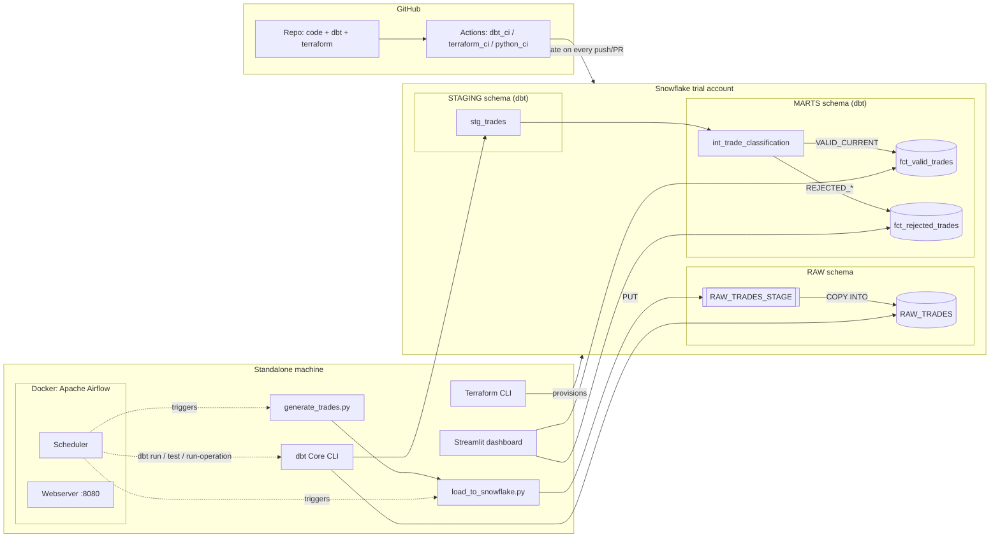
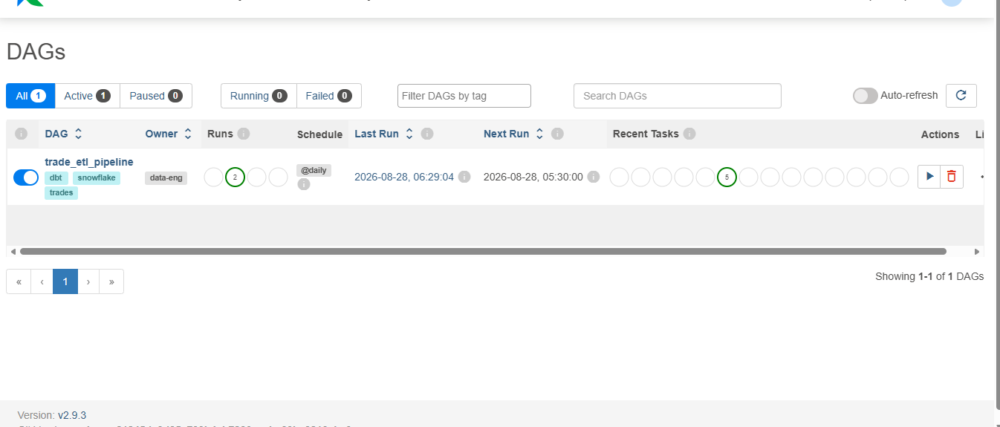
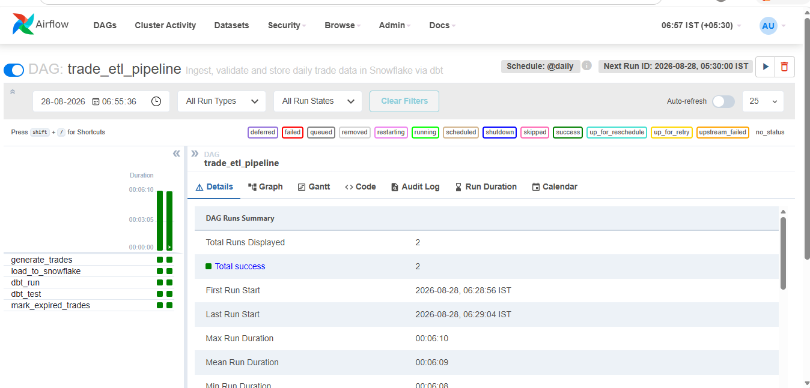
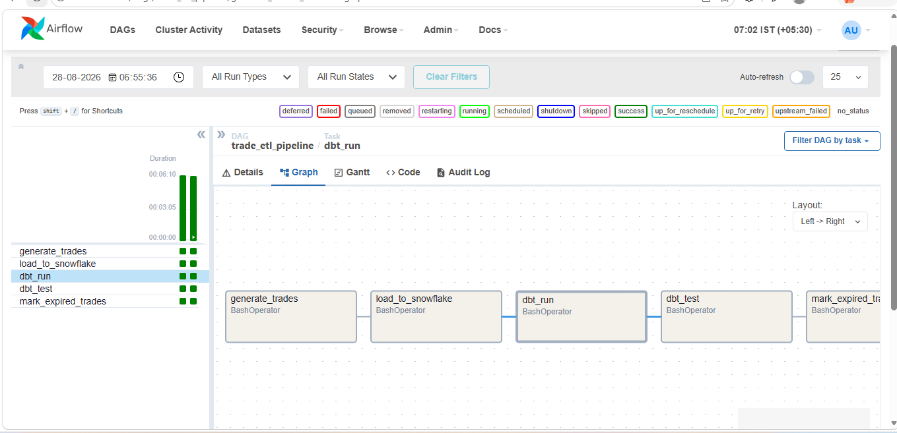
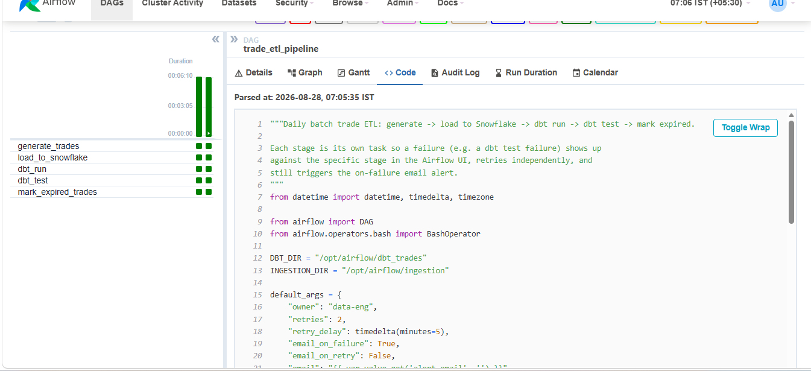
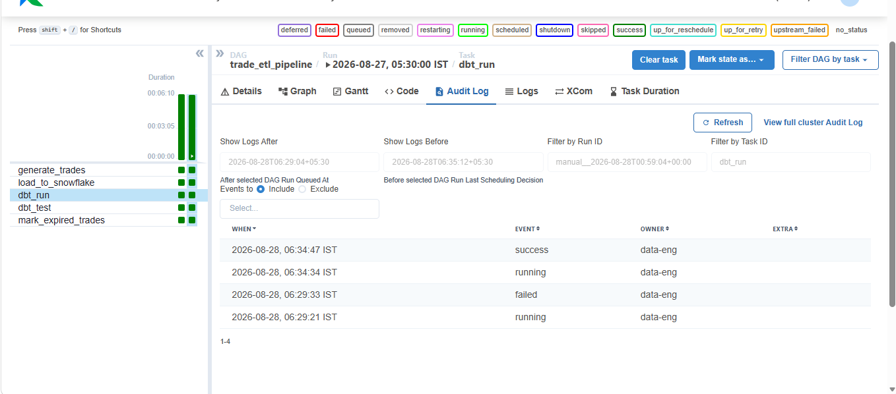
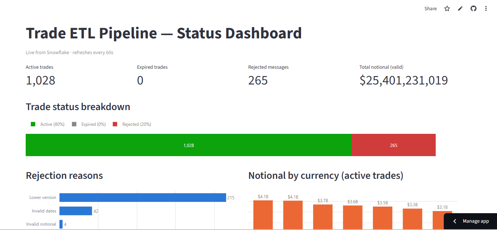
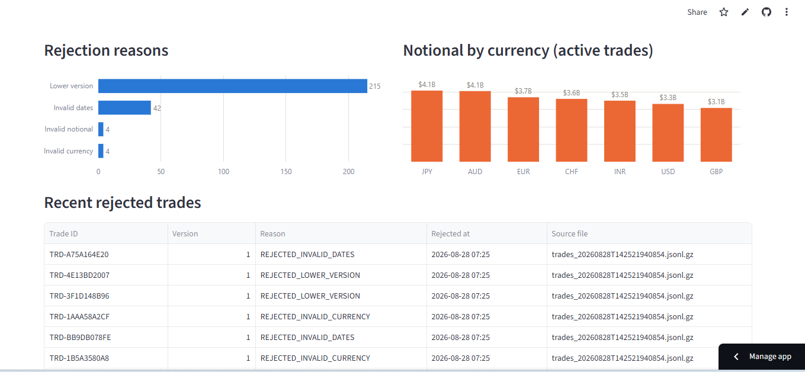
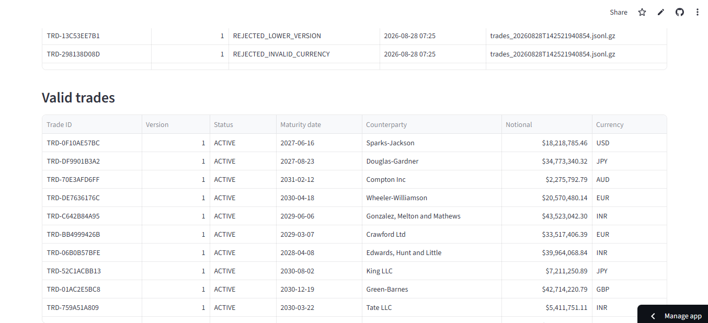

# Trade ETL Pipeline — Data Engineering Case Study

A batch ETL pipeline that simulates trade messages, loads them into Snowflake, applies
versioning/expiry/maturity business rules in dbt, stores valid and rejected trades
separately, and orchestrates the whole thing with Airflow.

**Live dashboard**: https://trade-etl-case-study.streamlit.app/ — public, no login needed,
pulling real data from the live warehouse. See [Proof](#proof) below for screenshots and
what's actually been verified.

## Status

| Area | State |
|---|---|
| Code: ingestion, dbt project, Terraform, Airflow DAG, dashboard, CI/CD | ✅ Complete, reviewed, and validated end-to-end (see [Validated so far](#validated-so-far)) |
| Snowflake trial account | ✅ Live (AWS Singapore) |
| `terraform apply` | ✅ Applied — warehouse/database/schemas/role/grants/monitoring live, zero drift, remote state in Terraform Cloud |
| `dbt run` / `dbt test` against the live warehouse | ✅ Run repeatedly against real data, 13/13 tests passing, all 4 non-supersede rejection reasons exercised |
| Docker Desktop + WSL2 + Airflow | ✅ Installed and running — `trade_etl_pipeline` DAG executed end-to-end in Docker (generate → load → dbt run → dbt test → mark expired, all tasks succeeded) |
| Streamlit dashboard | ✅ Redesigned and run locally against live Snowflake data |
| CI/CD: validate + deploy | ✅ `dbt_ci`/`terraform_ci` validate on every push/PR; deploy jobs (`dbt-deploy`, `terraform-apply`) run on merge to `main`, gated behind a `production` GitHub Environment requiring manual approval — 6 PRs merged this way, all green |
| Live Snowflake Alert | ✅ `HIGH_REJECTION_RATE` alert + email notification integration, provisioned via Terraform, fired for real and email delivery confirmed |

Every stage has been executed against the real pipeline, not just written and assumed
correct — see [Validated so far](#validated-so-far) and
[docs/validation_logic.md](docs/validation_logic.md#verified-against-a-live-warehouse)
for specifics, including a real bug (rule 3's date anchor) that live testing caught and
a fix later confirmed.

## Architecture



This shows the core data flow. CI/CD deploy (with an approval gate) and monitoring/alerting
are a separate concern with their own diagram, plus a full write-up covering failure
handling, Snowflake monitoring/alerts, and 10,000x scaling — see
[docs/architecture.md](docs/architecture.md#cicd-and-monitoring-architecture). PlantUML
sources for both diagrams: [docs/diagrams/](docs/diagrams/).

## Quick start

Full walkthrough: [docs/setup_guide.md](docs/setup_guide.md). Short version, once you
have a Snowflake trial account, a free Terraform Cloud account for remote state
(`terraform login` or a token in `%APPDATA%\terraform.d\credentials.tfrc.json` - see
setup guide §3), and tools installed:

```powershell
cd terraform && terraform init && terraform apply         # provision warehouse/db/schema/stage/role/alert
cd ..
copy .env.example .env                                    # fill in Snowflake creds
copy dbt_trades\profiles.yml.example dbt_trades\profiles.yml

python ingestion\generate_trades.py --count 200
python ingestion\load_to_snowflake.py

cd dbt_trades && dbt run && dbt test && dbt run-operation mark_expired_trades
cd .. && streamlit run dashboard\streamlit_app.py
```

## Repository layout

| Path | What's in it |
|---|---|
| [`ingestion/`](ingestion/) | Simulated trade generator + the Snowflake-native loader (`PUT` + `COPY INTO`) |
| [`dbt_trades/`](dbt_trades/) | dbt project: `staging` → `int_trade_classification` → `fct_valid_trades` / `fct_rejected_trades`. Start reading at [docs/validation_logic.md](docs/validation_logic.md) |
| [`terraform/`](terraform/) | Snowflake infra as code — warehouse, database, `RAW` schema, stage, role + grants, monitoring alert; remote state in Terraform Cloud |
| [`orchestration/airflow/`](orchestration/airflow/) | The DAG (`dags/trade_etl_dag.py`) plus a Docker Compose stack to run it |
| [`dashboard/`](dashboard/) | Streamlit trade-status dashboard (`streamlit_app.py`) |
| [`docs/`](docs/) | Architecture, setup guide, validation-logic writeup, PlantUML diagram source |
| [`.github/workflows/`](.github/workflows/) | CI for dbt, Terraform, and the Python scripts |

## Business rules implemented (dbt)

All six live in one place: [`dbt_trades/models/marts/int_trade_classification.sql`](dbt_trades/models/marts/int_trade_classification.sql). Rule-by-rule rationale: [docs/validation_logic.md](docs/validation_logic.md).

1. Reject trades with a lower version than existing
2. Replace trades with the same version
3. Reject trades with a maturity date earlier than today
4. Mark trades as expired once the maturity date has passed
5. Optional extra rules: non-positive notional, unsupported currency, maturity before trade date
6. All rejections logged to an append-only `fct_rejected_trades` audit table

## Tech stack

Snowflake (ingestion + storage + native Alerts) · dbt Core (`dbt-snowflake`) ·
Apache Airflow (Docker) · Terraform (`Snowflake-Labs/snowflake` provider, remote state in
Terraform Cloud) · Streamlit · GitHub Actions (validate + approval-gated deploy)

## Validated so far

Every layer has been run for real against a live Snowflake trial account, not just
written and assumed correct:

- `terraform apply` — provisioned `TRADE_ETL_WH`, `TRADE_ETL_DB`, `RAW`/`STAGING`/`MARTS`
  schemas, role and grants, and the `HIGH_REJECTION_RATE` monitoring alert; `terraform
  plan` shows zero drift against remote state in Terraform Cloud
- `ingestion/generate_trades.py` + `load_to_snowflake.py` — run repeatedly, staged and
  `COPY INTO`-loaded real trade batches into `RAW.RAW_TRADES`, including deliberately
  invalid notional/currency values so every rejection rule gets real coverage
- `dbt run` + `dbt test` — run against live data, 13/13 tests passing; see
  [docs/validation_logic.md](docs/validation_logic.md#verified-against-a-live-warehouse)
  for the rule-by-rule breakdown
- `orchestration/airflow/` — full Docker Compose stack (Postgres, webserver, scheduler)
  brought up, `trade_etl_pipeline` DAG unpaused and triggered; every task
  (`generate_trades` → `load_to_snowflake` → `dbt_run` → `dbt_test` →
  `mark_expired_trades`) succeeded end-to-end
- `dashboard/streamlit_app.py` — redesigned and run against live `fct_valid_trades` /
  `fct_rejected_trades` data
- **CI/CD deploy, not just validate**: `terraform-apply` and `dbt-deploy` jobs run on
  merge to `main`, gated behind a `production` GitHub Environment's required-reviewer
  approval — 6 PRs merged through this exact flow, all green
- **Live Snowflake Alert, not just documented**: generated real trade batches until
  rejections crossed the alert's threshold, fired it, and confirmed both the
  `ALERT_HISTORY` state (`TRIGGERED`) and actual email delivery
- `ruff check` — clean across `ingestion/`, `dashboard/`, `orchestration/`
- Several real bugs were caught only by live testing, not by inspection — a dbt/Airflow
  version-skew crash, a GitHub Actions workflow that silently never parsed, a Terraform
  state split between local and CI that caused a live role grant to be briefly revoked,
  and an untested rejection rule that could structurally never fire. See
  [docs/validation_logic.md](docs/validation_logic.md) and
  [docs/architecture.md](docs/architecture.md) for the details

## Proof

Screenshots and raw command output for everything claimed above live in
[docs/proof/](docs/proof/). Highlights:

**Airflow — `trade_etl_pipeline` DAG**

| | |
|---|---|
|  |  |
|  |  |



That last one is worth calling out specifically: it's the Audit Log for a scheduled
`dbt_run` task going `failed` → `running` → `success`, about 5 minutes apart, matching
this DAG's configured retry (`retries: 2, retry_delay: 5 minutes`) exactly. This is a
real automatic recovery, not a staged screenshot — see the "CI/CD hardening" section of
[docs/architecture.md](docs/architecture.md) for the specific bug it was recovering from.

**Streamlit — live dashboard** ([open it yourself](https://trade-etl-case-study.streamlit.app/))

| | |
|---|---|
|  |  |



**Terraform and dbt — raw output**

- [`docs/proof/terraform_plan_zero_drift.txt`](docs/proof/terraform_plan_zero_drift.txt): `terraform plan` against the live warehouse, "No changes"
- [`docs/proof/dbt_test_13_of_13.txt`](docs/proof/dbt_test_13_of_13.txt): `dbt test` run against live data, 13/13 passing
- GitHub Actions history is public and needs no separate proof file: [github.com/ramanjaneyulu73/trade-etl-case-study/actions](https://github.com/ramanjaneyulu73/trade-etl-case-study/actions)
