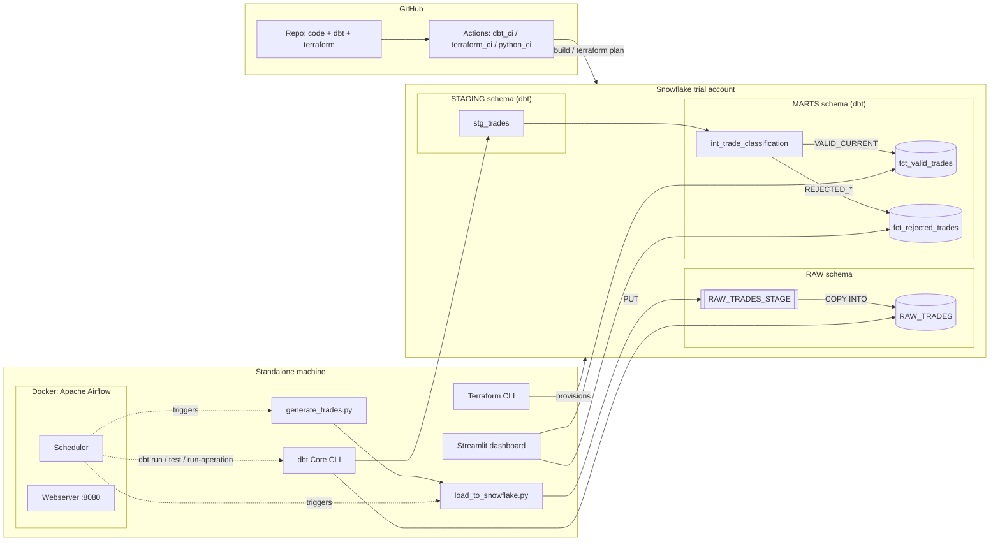

# Trade ETL Pipeline — Data Engineering Case Study

A batch ETL pipeline that simulates trade messages, loads them into Snowflake, applies
versioning/expiry/maturity business rules in dbt, stores valid and rejected trades
separately, and orchestrates the whole thing with Airflow.

## Status

| Area | State |
|---|---|
| Code: ingestion, dbt project, Terraform, Airflow DAG, dashboard, CI | ✅ Complete, reviewed, and locally validated (see [Validated so far](#validated-so-far)) |
| Snowflake trial account | ⏳ Pending — needs a human to sign up in a browser, see [setup guide §1](docs/setup_guide.md#1-create-a-free-snowflake-trial-account) |
| `terraform apply` / `dbt run` against a live warehouse | ⏳ Pending on the above |
| Docker Desktop + WSL2 (for the Airflow container) | ⏳ Pending — needs an elevated terminal + reboot, see [setup guide §2](docs/setup_guide.md#docker-desktop--wsl2-needs-your-action--requires-admin--a-reboot) |

Nothing in the pipeline has run against a real Snowflake warehouse yet — everything
below is validated as far as it can be without one (see below).

## Architecture



Full write-up (failure handling, Snowflake monitoring/alerts, 10,000x scaling):
[docs/architecture.md](docs/architecture.md). Diagram source (PlantUML):
[docs/diagrams/architecture.puml](docs/diagrams/architecture.puml).

## Quick start

Full walkthrough: [docs/setup_guide.md](docs/setup_guide.md). Short version, once you
have a Snowflake trial account and tools installed:

```powershell
cd terraform && terraform init && terraform apply         # provision warehouse/db/schema/stage/role
cd ..
copy .env.example .env                                    # fill in Snowflake creds
copy dbt_trades\profiles.yml.example dbt_trades\profiles.yml

python ingestion\generate_trades.py --count 200
python ingestion\load_to_snowflake.py

cd dbt_trades && dbt run && dbt test && dbt run-operation mark_expired_trades
cd .. && streamlit run dashboard\streamlit_app.py
```

## Repository layout

| Path | What's in it |
|---|---|
| [`ingestion/`](ingestion/) | Simulated trade generator + the Snowflake-native loader (`PUT` + `COPY INTO`) |
| [`dbt_trades/`](dbt_trades/) | dbt project: `staging` → `int_trade_classification` → `fct_valid_trades` / `fct_rejected_trades`. Start reading at [docs/validation_logic.md](docs/validation_logic.md) |
| [`terraform/`](terraform/) | Snowflake infra as code — warehouse, database, `RAW` schema, stage, role + grants |
| [`orchestration/airflow/`](orchestration/airflow/) | The DAG (`dags/trade_etl_dag.py`) plus a Docker Compose stack to run it |
| [`dashboard/`](dashboard/) | Streamlit trade-status dashboard (`streamlit_app.py`) |
| [`docs/`](docs/) | Architecture, setup guide, validation-logic writeup, PlantUML diagram source |
| [`.github/workflows/`](.github/workflows/) | CI for dbt, Terraform, and the Python scripts |

## Business rules implemented (dbt)

All six live in one place: [`dbt_trades/models/marts/int_trade_classification.sql`](dbt_trades/models/marts/int_trade_classification.sql). Rule-by-rule rationale: [docs/validation_logic.md](docs/validation_logic.md).

1. Reject trades with a lower version than existing
2. Replace trades with the same version
3. Reject trades with a maturity date earlier than today
4. Mark trades as expired once the maturity date has passed
5. Optional extra rules: non-positive notional, unsupported currency, maturity before trade date
6. All rejections logged to an append-only `fct_rejected_trades` audit table

## Tech stack

Snowflake (ingestion + storage) · dbt Core (`dbt-snowflake`) · Apache Airflow (Docker) ·
Terraform (`Snowflake-Labs/snowflake` provider) · Streamlit · GitHub Actions

## Validated so far

Everything that doesn't require a live Snowflake connection has been run, not just
written:

- `ingestion/generate_trades.py` — executed, produces well-formed trade batches
- `ruff check` — clean across `ingestion/`, `dashboard/`, `orchestration/`
- `dbt parse` — the full dbt project (4 models, 13 data tests, 1 macro, 1 source)
  parses cleanly with no warnings
- `terraform fmt` / `terraform init` / `terraform validate` — clean, validated against
  the actual installed `Snowflake-Labs/snowflake` v0.100.0 provider schema (not just
  written from memory — several resource names had changed since the provider's older
  docs, e.g. `snowflake_role` → `snowflake_account_role`, the `*_grant` resources →
  `snowflake_grant_privileges_to_account_role`)

Not yet possible without a live warehouse: `dbt run`/`dbt test`/`dbt build`,
`terraform apply`, the Airflow DAG end-to-end, and the dashboard against real data.
