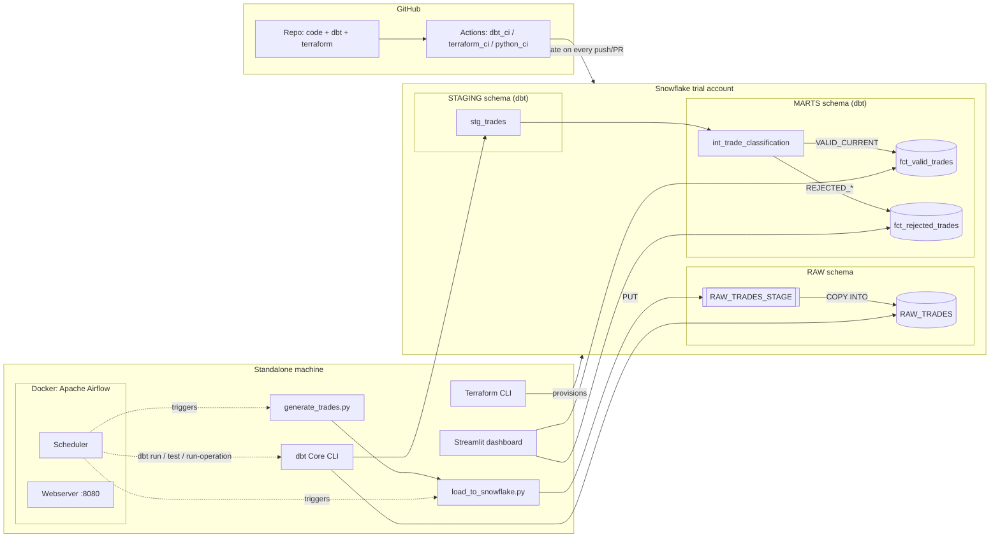
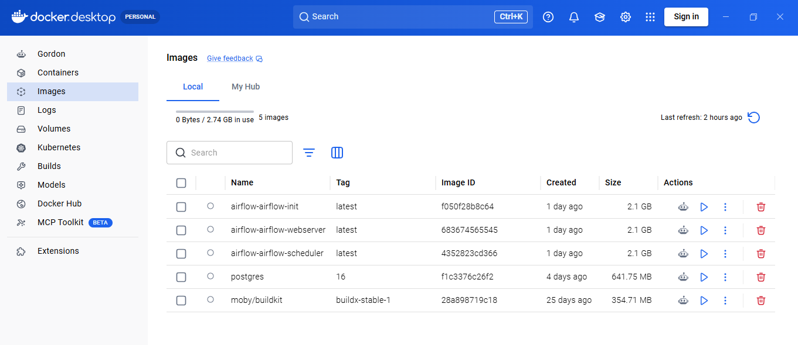
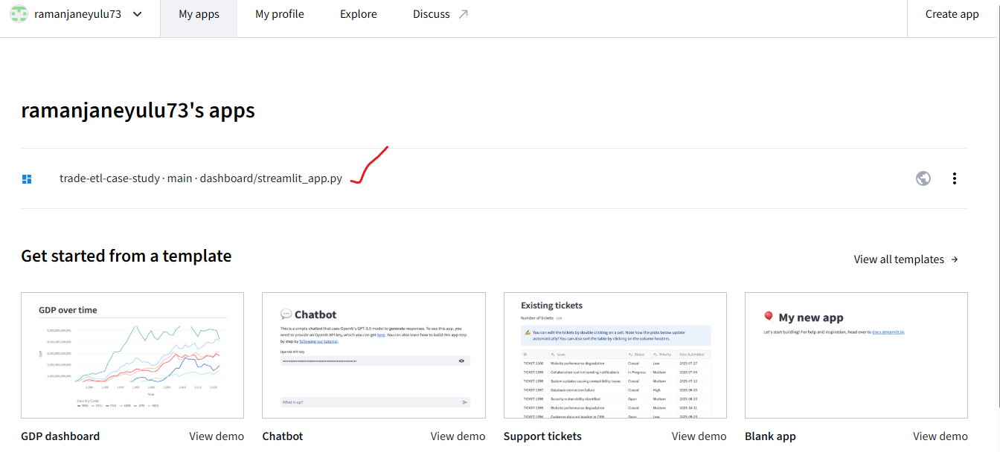
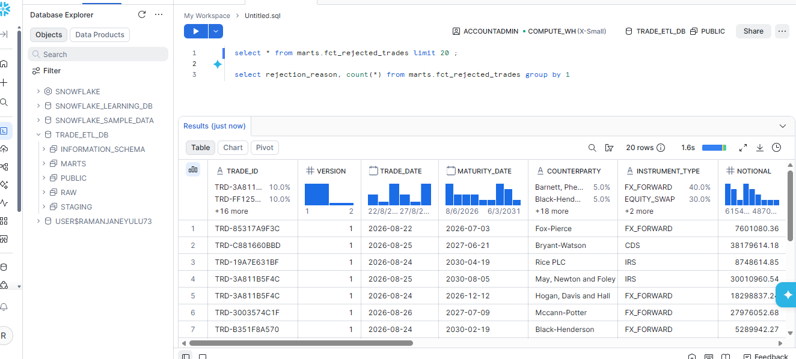
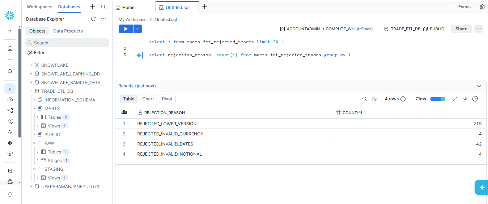
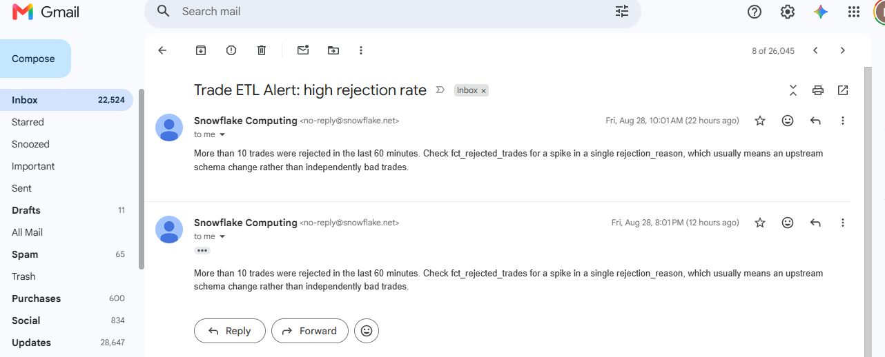
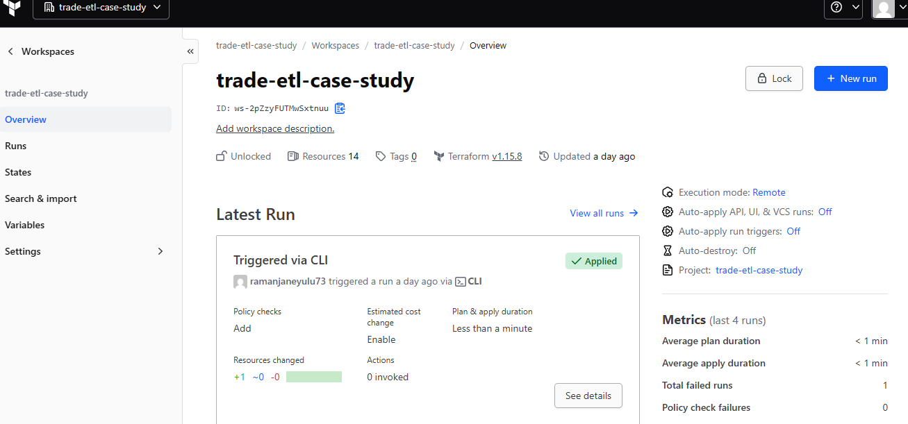
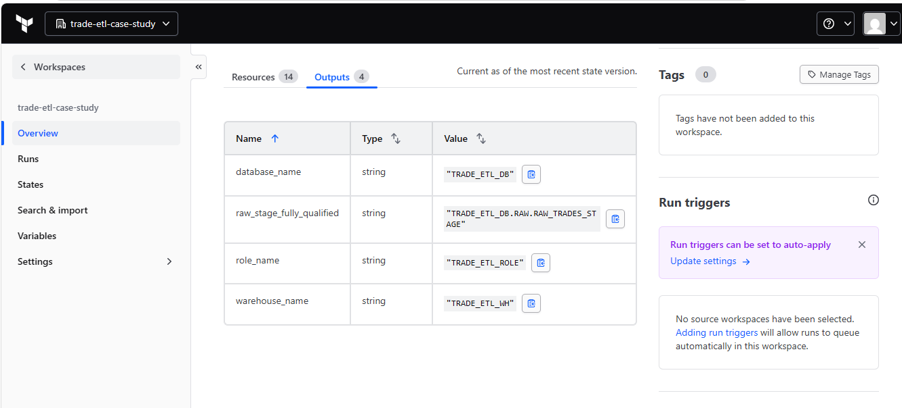
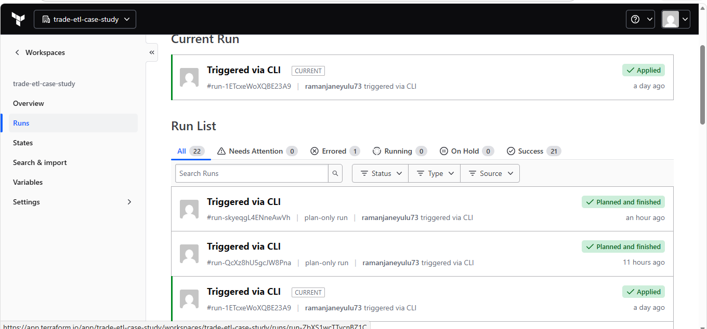

# Trade ETL Pipeline — Data Engineering Case Study

A batch ETL pipeline that simulates trade messages, loads them into Snowflake, applies
versioning/expiry/maturity business rules in dbt, stores valid and rejected trades
separately, and orchestrates the whole thing with Airflow.

**Live dashboard**: https://trade-etl-case-study.streamlit.app/ — public, no login needed,
pulling real data from the live warehouse. See [Proof](#proof) below for screenshots and
what's actually been verified.

## Status

| Area | State |
|---|---|
| Code: ingestion, dbt project, Terraform, Airflow DAG, dashboard, CI/CD | ✅ Complete and validated end-to-end (see [Validated so far](#validated-so-far)) |
| Snowflake trial account | ✅ Live (AWS Singapore) |
| `terraform apply` | ✅ Applied. Warehouse, database, schemas, role, grants, and monitoring are all live. Zero drift, remote state in Terraform Cloud |
| `dbt run` / `dbt test` against the live warehouse | ✅ 13/13 tests passing, all 4 non-supersede rejection reasons exercised |
| Docker Desktop + WSL2 + Airflow | ✅ `trade_etl_pipeline` DAG has run end-to-end in Docker: generate, load, dbt run, dbt test, mark expired, all tasks green |
| Streamlit dashboard | ✅ Redesigned, running against live Snowflake data |
| CI/CD: validate + deploy | ✅ `dbt_ci`/`terraform_ci` validate on every push/PR. Deploy jobs run on merge to `main`, gated behind a `production` GitHub Environment that needs manual approval. 6 PRs merged this way so far, all green |
| Live Snowflake Alert | ✅ `HIGH_REJECTION_RATE` alert with an email notification integration, provisioned via Terraform, fired for real |

Everything below has been run against the live pipeline, not just written and reasoned
about. [Validated so far](#validated-so-far) and
[docs/validation_logic.md](docs/validation_logic.md#verified-against-a-live-warehouse)
have the specifics, including a bug in rule 3's date anchor that only showed up once we
started running things for real.

## Architecture



That's the core data flow. CI/CD deploy (with an approval gate) and monitoring get their
own diagram, along with a longer write-up on failure handling, Snowflake monitoring, and
scaling to 10,000x: see [docs/architecture.md](docs/architecture.md#cicd-and-monitoring-architecture).
PlantUML sources for both diagrams live in [docs/diagrams/](docs/diagrams/).

## Quick start

Full walkthrough: [docs/setup_guide.md](docs/setup_guide.md). Short version, assuming
you already have a Snowflake trial account, a free Terraform Cloud account for remote
state (`terraform login`, or a token in `%APPDATA%\terraform.d\credentials.tfrc.json` —
setup guide §3), and the required tools:

```powershell
cd terraform && terraform init && terraform apply         # provision warehouse/db/schema/stage/role/alert
cd ..
copy .env.example .env                                    # fill in Snowflake creds
copy dbt_trades\profiles.yml.example dbt_trades\profiles.yml

python ingestion\generate_trades.py --count 200
python ingestion\load_to_snowflake.py

cd dbt_trades && dbt run && dbt test && dbt run-operation mark_expired_trades
cd .. && streamlit run dashboard\streamlit_app.py
```

## Repository layout

| Path | What's in it |
|---|---|
| [`ingestion/`](ingestion/) | Simulated trade generator + the Snowflake-native loader (`PUT` + `COPY INTO`) |
| [`dbt_trades/`](dbt_trades/) | dbt project: `staging` → `int_trade_classification` → `fct_valid_trades` / `fct_rejected_trades`. Start reading at [docs/validation_logic.md](docs/validation_logic.md) |
| [`terraform/`](terraform/) | Warehouse, database, `RAW` schema, stage, role and grants, monitoring alert. Remote state in Terraform Cloud |
| [`orchestration/airflow/`](orchestration/airflow/) | The DAG (`dags/trade_etl_dag.py`) plus a Docker Compose stack to run it |
| [`dashboard/`](dashboard/) | Streamlit trade-status dashboard (`streamlit_app.py`) |
| [`docs/`](docs/) | Architecture, setup guide, validation-logic writeup, PlantUML diagram sources |
| [`.github/workflows/`](.github/workflows/) | CI for dbt, Terraform, and the Python scripts |

## Business rules implemented (dbt)

All six live in one place: [`dbt_trades/models/marts/int_trade_classification.sql`](dbt_trades/models/marts/int_trade_classification.sql). Rule-by-rule rationale: [docs/validation_logic.md](docs/validation_logic.md).

1. Reject trades with a lower version than existing
2. Replace trades with the same version
3. Reject trades with a maturity date earlier than today
4. Mark trades as expired once the maturity date has passed
5. Optional extra rules: non-positive notional, unsupported currency, maturity before trade date
6. All rejections logged to an append-only `fct_rejected_trades` audit table

## Tech stack

Snowflake (ingestion, storage, native Alerts) · dbt Core (`dbt-snowflake`) · Apache
Airflow (Docker) · Terraform (`Snowflake-Labs/snowflake` provider, remote state in
Terraform Cloud) · Streamlit · GitHub Actions (validate + approval-gated deploy)

## Validated so far

Everything here ran against a live Snowflake trial account. None of it is "should
work in theory":

- `terraform apply` provisioned `TRADE_ETL_WH`, `TRADE_ETL_DB`, the `RAW`/`STAGING`/`MARTS`
  schemas, role and grants, and the `HIGH_REJECTION_RATE` monitoring alert. `terraform
  plan` shows zero drift against remote state in Terraform Cloud.
- `generate_trades.py` and `load_to_snowflake.py` have been run repeatedly, staging and
  `COPY INTO`-loading real trade batches into `RAW.RAW_TRADES`. The generator also
  produces some deliberately invalid notional and currency values so every rejection
  rule actually gets exercised, not just the common ones.
- `dbt run` + `dbt test`: 13/13 tests passing. See
  [docs/validation_logic.md](docs/validation_logic.md#verified-against-a-live-warehouse)
  for the rule-by-rule breakdown.
- The full Docker Compose Airflow stack (Postgres, webserver, scheduler) has been
  brought up and the `trade_etl_pipeline` DAG triggered end to end: generate, load,
  dbt run, dbt test, mark expired, every task succeeded.
- The dashboard has been redesigned and runs against live `fct_valid_trades` /
  `fct_rejected_trades` data.
- CI/CD actually deploys, it doesn't just validate. `terraform-apply` and `dbt-deploy`
  run on merge to `main`, gated behind a `production` Environment's required-reviewer
  approval. 6 PRs have gone through this flow, all green.
- The Snowflake Alert isn't just sitting there configured. Real trade batches were
  generated until rejections crossed the alert's threshold, the alert fired, and both
  `ALERT_HISTORY` (state `TRIGGERED`) and the actual email confirm it works.
- `ruff check` is clean across `ingestion/`, `dashboard/`, `orchestration/`.

A handful of bugs only turned up because things were actually run, not just read: a
dbt/Airflow version mismatch that crashed the container, a GitHub Actions workflow that
silently never parsed at all, a Terraform state split between local and CI that briefly
revoked a live role grant, and a rejection rule that could never have fired with the
original test-data generator. Details in
[docs/validation_logic.md](docs/validation_logic.md) and
[docs/architecture.md](docs/architecture.md).

## Proof

Screenshots and raw command output for everything claimed above live in
[docs/proof/](docs/proof/). Highlights:

**Airflow — `trade_etl_pipeline` DAG**

| | |
|---|---|
|  |  |
|  |  |


That last one is worth calling out specifically: it's the Audit Log for a scheduled
`dbt_run` task going `failed` → `running` → `success`, about 5 minutes apart, matching
this DAG's configured retry (`retries: 2, retry_delay: 5 minutes`) exactly. This is a
real automatic recovery, not a staged screenshot — see the "CI/CD hardening" section of
[docs/architecture.md](docs/architecture.md) for the specific bug it was recovering from.

[`docs/proof/docker_ps.txt`](docs/proof/docker_ps.txt) is a plain `docker ps` capture
showing the actual containers behind these screenshots: the Postgres metadata DB, the
scheduler, and the webserver serving port 8080 — this is the same Docker Compose stack
(`orchestration/airflow/docker-compose.yaml`) described in the setup guide, not something
different in a screenshot.



The containers themselves get torn down between runs to free up RAM on a
resource-constrained machine (see `docs/setup_guide.md`'s Docker Desktop / WSL2 note),
but the images they're built from persist locally — this is Docker Desktop's own Images
tab, not just the CLI.

**Streamlit — live dashboard** ([open it yourself](https://trade-etl-case-study.streamlit.app/))

| | |
|---|---|
|  |  |




That last one shows the actual deployment record: this app, on this account, built from
`trade-etl-case-study · main · dashboard/streamlit_app.py` — not a different app that
happens to look similar.

**Snowflake — Snowsight**

| | |
|---|---|
|  |  |

The database tree shows `RAW`/`STAGING`/`MARTS` under `TRADE_ETL_DB` with real
table/view counts, and the rejection-reason counts in the second query
(215/4/42/4) match the dashboard and `dbt_test` output exactly — same
underlying data, three different views of it.

**Snowflake Alert — running unattended, not a one-off demo**



[`docs/proof/snowflake_alert_history.txt`](docs/proof/snowflake_alert_history.txt) is a
fresh `ALERT_HISTORY` query, not the same run described in the "CI/CD hardening" section
of [docs/architecture.md](docs/architecture.md). It shows `HIGH_REJECTION_RATE` firing on
its own 60-minute schedule continuously since it was created, entirely without anyone
watching: two real `TRIGGERED` events roughly 10 hours apart (both landed in the inbox
above), one `ACTION_FAILED` from the missing-grant bug before it was fixed, and
`CONDITION_FALSE` on every other tick, which is what a healthy run looks like when
rejection volume is normal. This isn't a screenshot of one lucky firing, it's the alert
doing its job for over a day straight, landing in a real inbox.

**Terraform Cloud and dbt**

| | |
|---|---|
|  |  |



The run history shows "Errored 1" out of 22 runs, not a suspiciously perfect all-green
history — that one error is the case-mismatch incident documented in the "CI/CD
hardening" section of [docs/architecture.md](docs/architecture.md), left visible rather
than only showing the clean runs.

- [`docs/proof/terraform_plan_zero_drift.txt`](docs/proof/terraform_plan_zero_drift.txt): `terraform plan` against the live warehouse, "No changes"
- [`docs/proof/dbt_test_13_of_13.txt`](docs/proof/dbt_test_13_of_13.txt): `dbt test` run against live data, 13/13 passing
- GitHub Actions history is public and needs no separate proof file: [github.com/ramanjaneyulu73/trade-etl-case-study/actions](https://github.com/ramanjaneyulu73/trade-etl-case-study/actions)
