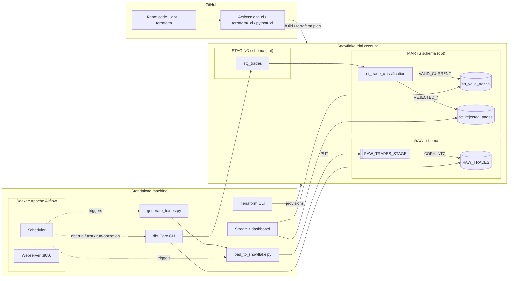

# Trade ETL Pipeline — Data Engineering Case Study

A batch ETL pipeline that simulates trade messages, loads them into Snowflake, applies
versioning/expiry/maturity business rules in dbt, stores valid and rejected trades
separately, and orchestrates the whole thing with Airflow.

## Status

| Area | State |
|---|---|
| Code: ingestion, dbt project, Terraform, Airflow DAG, dashboard, CI | ✅ Complete, reviewed, and validated end-to-end (see [Validated so far](#validated-so-far)) |
| Snowflake trial account | ✅ Live (AWS Singapore) |
| `terraform apply` | ✅ Applied — warehouse/database/schemas/role/grants live, zero drift |
| `dbt run` / `dbt test` against the live warehouse | ✅ Run repeatedly against real data, 13/13 tests passing |
| Docker Desktop + WSL2 + Airflow | ✅ Installed and running — `trade_etl_pipeline` DAG executed end-to-end in Docker (generate → load → dbt run → dbt test → mark expired, all tasks succeeded) |
| Streamlit dashboard | ✅ Run locally against live Snowflake data |

Every stage has been executed against the real pipeline, not just written and assumed
correct — see [Validated so far](#validated-so-far) and
[docs/validation_logic.md](docs/validation_logic.md#verified-against-a-live-warehouse)
for specifics, including a real bug (rule 3's date anchor) that live testing caught and
a fix later confirmed.

## Architecture



Full write-up (failure handling, Snowflake monitoring/alerts, 10,000x scaling):
[docs/architecture.md](docs/architecture.md). Diagram source (PlantUML):
[docs/diagrams/architecture.puml](docs/diagrams/architecture.puml).

## Quick start

Full walkthrough: [docs/setup_guide.md](docs/setup_guide.md). Short version, once you
have a Snowflake trial account and tools installed:

```powershell
cd terraform && terraform init && terraform apply         # provision warehouse/db/schema/stage/role
cd ..
copy .env.example .env                                    # fill in Snowflake creds
copy dbt_trades\profiles.yml.example dbt_trades\profiles.yml

python ingestion\generate_trades.py --count 200
python ingestion\load_to_snowflake.py

cd dbt_trades && dbt run && dbt test && dbt run-operation mark_expired_trades
cd .. && streamlit run dashboard\streamlit_app.py
```

## Repository layout

| Path | What's in it |
|---|---|
| [`ingestion/`](ingestion/) | Simulated trade generator + the Snowflake-native loader (`PUT` + `COPY INTO`) |
| [`dbt_trades/`](dbt_trades/) | dbt project: `staging` → `int_trade_classification` → `fct_valid_trades` / `fct_rejected_trades`. Start reading at [docs/validation_logic.md](docs/validation_logic.md) |
| [`terraform/`](terraform/) | Snowflake infra as code — warehouse, database, `RAW` schema, stage, role + grants |
| [`orchestration/airflow/`](orchestration/airflow/) | The DAG (`dags/trade_etl_dag.py`) plus a Docker Compose stack to run it |
| [`dashboard/`](dashboard/) | Streamlit trade-status dashboard (`streamlit_app.py`) |
| [`docs/`](docs/) | Architecture, setup guide, validation-logic writeup, PlantUML diagram source |
| [`.github/workflows/`](.github/workflows/) | CI for dbt, Terraform, and the Python scripts |

## Business rules implemented (dbt)

All six live in one place: [`dbt_trades/models/marts/int_trade_classification.sql`](dbt_trades/models/marts/int_trade_classification.sql). Rule-by-rule rationale: [docs/validation_logic.md](docs/validation_logic.md).

1. Reject trades with a lower version than existing
2. Replace trades with the same version
3. Reject trades with a maturity date earlier than today
4. Mark trades as expired once the maturity date has passed
5. Optional extra rules: non-positive notional, unsupported currency, maturity before trade date
6. All rejections logged to an append-only `fct_rejected_trades` audit table

## Tech stack

Snowflake (ingestion + storage) · dbt Core (`dbt-snowflake`) · Apache Airflow (Docker) ·
Terraform (`Snowflake-Labs/snowflake` provider) · Streamlit · GitHub Actions

## Validated so far

Every layer has been run for real against a live Snowflake trial account, not just
written and assumed correct:

- `terraform apply` — provisioned `TRADE_ETL_WH`, `TRADE_ETL_DB`, `RAW`/`STAGING`/`MARTS`
  schemas, role and grants; `terraform plan` shows zero drift
- `ingestion/generate_trades.py` + `load_to_snowflake.py` — run repeatedly, staged and
  `COPY INTO`-loaded real trade batches into `RAW.RAW_TRADES`
- `dbt run` + `dbt test` — run against live data, 13/13 tests passing; see
  [docs/validation_logic.md](docs/validation_logic.md#verified-against-a-live-warehouse)
  for the rule-by-rule breakdown, including two hand-crafted trades used to isolate
  rules 3 and 4 individually
- `orchestration/airflow/` — full Docker Compose stack (Postgres, webserver, scheduler)
  brought up, `trade_etl_pipeline` DAG unpaused and triggered; every task
  (`generate_trades` → `load_to_snowflake` → `dbt_run` → `dbt_test` →
  `mark_expired_trades`) succeeded end-to-end
- `dashboard/streamlit_app.py` — run locally against live `fct_valid_trades` /
  `fct_rejected_trades` data
- `ruff check` — clean across `ingestion/`, `dashboard/`, `orchestration/`
- A real bug (rule 3 anchoring on `current_date()` instead of `loaded_at::date`, which
  would have retroactively un-accepted already-valid trades) was caught by this live
  testing, not by inspection, and fixed — see
  [docs/validation_logic.md](docs/validation_logic.md) for the full story
