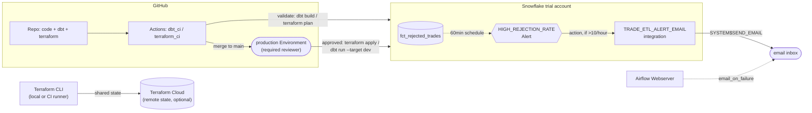

# Architecture

See the [README](../README.md#architecture) for the rendered component diagram (GitHub
renders it inline via Mermaid). The same diagram is also kept as PlantUML source at
[diagrams/architecture.puml](diagrams/architecture.puml) for tools that prefer it
(render with the PlantUML VS Code extension, or https://www.plantuml.com/plantuml).

## Data flow

1. `ingestion/generate_trades.py` simulates a batch of trade messages (new trades,
   amendments, same-version corrections, stale/out-of-order versions, already-matured
   trades) and writes them as a `.jsonl` file to `data/incoming/`.
2. `ingestion/load_to_snowflake.py` stages the file (`PUT`) to an internal Snowflake
   stage and loads it (`COPY INTO`) into `RAW.RAW_TRADES` as `VARIANT` rows, then moves
   the file to `data/processed/` so re-running never double-loads it.
3. `dbt run` builds `stg_trades` → `int_trade_classification` → `fct_valid_trades` /
   `fct_rejected_trades` (see `docs/validation_logic.md` for the rule-by-rule logic).
4. `dbt test` runs schema tests (not-null, uniqueness, accepted-values) plus a singular
   test asserting no valid trade has `maturity_date < trade_date`.
5. Apache Airflow (`orchestration/airflow/`) runs steps 1–4 daily as a DAG, with retries
   and email-on-failure.
6. `dashboard/streamlit_app.py` queries `fct_valid_trades` / `fct_rejected_trades`
   directly for a live status view.
7. Terraform (`terraform/`) provisions the warehouse, database, `RAW` schema, stage,
   landing table, and a `TRADE_ETL_ROLE` with the grants the pipeline needs. dbt owns
   the `STAGING`/`MARTS` schemas and everything inside them.

## Handling file arrival delays, data quality problems, and task failures

**File arrival delays.** `load_to_snowflake.py` only loads what's currently sitting in
`data/incoming/`, and it's idempotent since processed files get moved out, so a re-run
is a no-op. If a file shows up late, the next Airflow run just picks it up. There's no
fixed list of "expected" files to wait on. A stricter SLA would want an Airflow
`FileSensor` or `ExternalTaskSensor` with its own timeout and failure alert sitting in
front of `load_to_snowflake`, instead of the DAG quietly proceeding on partial data.

**Data quality problems.** Handled structurally, not bolted on afterward. Any message
that fails a rule lands in `fct_rejected_trades` with a specific `rejection_reason`
rather than getting dropped, and `dbt test` fails the run (and the Airflow task) if a
structural invariant is violated, e.g. a duplicate `trade_id` in `fct_valid_trades`, or
a null one. The distinction is deliberate: a bad row shouldn't stop the batch (reject it
and move on), but a broken invariant should stop the pipeline before bad data reaches
`MARTS`.

That handles bad *rows* inside an otherwise-loadable file. A structurally broken *file*
(invalid JSON, wrong shape) is a different failure mode one level up:
`load_to_snowflake.py` catches Snowflake's `ProgrammingError` for that specific file,
moves it to `data/quarantine/` instead of leaving it in `data/incoming/`, and keeps
loading the rest of the batch, then raises once at the end so the Airflow task still
fails and alerts. Without this, a single malformed file would fail the DAG identically
on every future run (never actually retried away) while also blocking every other file
in the same batch from loading. Confirmed live: a deliberately malformed `.jsonl`
alongside a valid one loads the good file, quarantines the bad one, and a re-run doesn't
re-attempt it.

**Task failures.** Every Airflow task retries twice with a 5-minute delay before
failing the DAG, and `email_on_failure=True` alerts on the final failure. Each stage
(generate, load, dbt run, dbt test, mark expired) is its own task, so the UI points at
exactly which one broke instead of a single opaque "pipeline failed." dbt itself fails
fast on a broken model rather than quietly producing partial output.

## Monitoring pipeline health with Snowflake's administrative views

Snowflake's `ACCOUNT_USAGE` and `INFORMATION_SCHEMA` views give visibility the pipeline
doesn't need to instrument itself:

- `QUERY_HISTORY`, filtered on `WAREHOUSE_NAME = 'TRADE_ETL_WH'`, catches slow or failed
  `dbt run`/`COPY INTO` statements. `EXECUTION_STATUS = 'FAIL'` surfaces broken queries
  before Airflow's retry even kicks in.
- `COPY_HISTORY` (the table function `information_schema.copy_history`) shows exactly
  which staged files loaded, how many rows, and any `COPY INTO` errors, independent of
  what the Python loader logged locally.
- `WAREHOUSE_METERING_HISTORY` gives credit consumption per hour for `TRADE_ETL_WH`. A
  spike with no matching rise in trade volume usually points to a regressed model (an
  accidental full table scan, say) rather than a bug in the business logic.
- `TASK_HISTORY` becomes relevant once `mark_expired_trades` or the classification step
  moves into a Snowflake Task instead of being triggered by Airflow.

Snowflake Alerts (`CREATE ALERT ... CONDITION ... ON SCHEDULE ...`) can watch these
views directly. Two natural conditions: `QUERY_HISTORY` showing `TRADE_ETL_WH` failures
in the last hour, or `fct_rejected_trades` growing by more than N% of `fct_valid_trades`
in a run (a rejection spike usually means an upstream schema change, not N independent
bad trades). Both would notify through a Snowflake Notification Integration, email or a
Slack/PagerDuty webhook. This complements Airflow's `email_on_failure` rather than
replacing it: Airflow tells you the job failed, Snowflake alerts tell you the data looks
wrong even when every job succeeded.

The second condition above is actually built, not just described. `terraform/monitoring.tf`
provisions a `HIGH_REJECTION_RATE` alert (the `snowflake_alert` and
`snowflake_email_notification_integration` resources) on a 60-minute schedule, emailing
via `SYSTEM$SEND_EMAIL` when `fct_rejected_trades` gains more than 10 rows in that
window. The `QUERY_HISTORY`/`WAREHOUSE_METERING_HISTORY` alerts follow the same pattern
against `ACCOUNT_USAGE` instead, and weren't built out here mainly because those views
carry a few hours of latency, which makes them awkward to demo live.

## CI/CD and monitoring architecture

This gets its own diagram rather than sharing one with the [core data flow](../README.md#architecture).
Cramming validate, the approval-gated deploy, remote state, and both alerting paths into
a single picture made it hard to trace, even though every individual piece is simple.
PlantUML source: [diagrams/cicd_monitoring.puml](diagrams/cicd_monitoring.puml).

The `production` Environment gate isn't there for show. The case-mismatch incident
described below, where a live role grant got briefly revoked, was caught right at this
gate, before it could compound into something worse.

Terraform Cloud only matters for this diagram - the CI/CD deploy path. Run Terraform on
its own with no `backend.tf` present and `terraform init` falls back to a local state
file, no account needed; that's the default a fresh clone gets (see
[docs/proof/terraform_local_state_init.txt](proof/terraform_local_state_init.txt)). Add
`backend.tf` (from `backend.tf.example`) and the exact same configuration runs against
Terraform Cloud instead, which is what CI does and what
[docs/proof/terraform_apply_after_backend_split.txt](proof/terraform_apply_after_backend_split.txt)
confirms still applies cleanly against the live warehouse.

## CI/CD hardening: what live deployment actually surfaced

The pipeline validates on every push/PR and deploys (`terraform-apply`, `dbt-deploy`) on
merge to `main`, gated behind the `production` Environment's required-reviewer approval.
Building this out surfaced four problems that `terraform validate`, `dbt parse`, or
reading the code carefully would never have caught:

**A workflow file that had never actually parsed.** `terraform_ci.yml` referenced
`secrets.SNOWFLAKE_ACCOUNT` directly inside a step's `if:` condition. GitHub Actions
rejects the entire workflow file for that ("Unrecognized named-value: 'secrets'") — it
doesn't fail a job, it fails to register the workflow at all, so you get 0 jobs and the
displayed name falls back to the file path instead of the workflow's actual name. Fixed
by assigning the secret to a job-level `env:` var first and checking `env.X` in `if:`
instead.

**No shared state between local and CI.** Local Terraform state was a gitignored file.
CI ran `terraform init -backend=false`, so `terraform-apply` had no idea what was
already provisioned and tried to recreate all 10 resources from scratch. It failed
cleanly on "already exists," so nothing broke, but there was also no working deploy.
Fixed with a Terraform Cloud remote backend shared by both.

**A live incident, caught by the gate built to catch it.** Once shared state was fixed,
the very next `terraform-apply` run executed a real destructive change: `service_user_name`
came through as lowercase from a GitHub secret sourced from a lowercase `.env` value,
while state had it uppercase from the `.tfvars` used for the original local apply.
Terraform read that as a genuine diff and replaced the role grant — the destroy
succeeded, the recreate failed on a case-sensitive lookup, and the live service user was
briefly left without its role. Restored by hand within minutes, then fixed properly with
`user_name = upper(var.service_user_name)` in `main.tf`, so the plan stays stable no
matter how any given credential source happens to be cased. This is the whole reason the
deploy jobs pause for approval instead of auto-applying: the gate didn't prevent the
mistake, but it's why this one got caught before it went further.

**A grant missed between two admin roles.** The alert's email notification integration
had to be created as `ACCOUNTADMIN`, since creating integrations is account-level
territory in Snowflake, but that doesn't grant any other role access to it. The alert
itself (owned by `TRADE_ETL_ROLE`, so it can read `MARTS.FCT_REJECTED_TRADES`) evaluated
its condition fine against real data, then failed the action step with "not authorized"
until `TRADE_ETL_ROLE` got explicit `USAGE` on the integration. Confirmed fixed by
re-firing the alert and checking `ALERT_HISTORY` for `TRIGGERED` with `sql_error_code 0`.

## Scalability: what changes at 10,000x volume

The current design does a full recompute of `int_trade_classification` and a
full-refresh rebuild of `fct_valid_trades` on every run. That's fine at case-study
volume, but it re-scans the entire trade history each time, which doesn't scale
linearly forever. At 10,000x:

**Ingestion** would swap the manual `PUT`/`COPY INTO` script for Snowpipe (auto-ingest
on file arrival) or Snowpipe Streaming if trades need to land closer to real time than
daily batches allow. No schema changes needed, just how files reach the stage.

**Classification would become incremental.** `int_trade_classification` would filter to
rows landed since the last run (`loaded_at > watermark`), and the "existing version"
lookup would compare against `fct_valid_trades` itself as a self-referential merge
rather than recomputing from full history. This is also where `mark_expired_trades()`
stops being redundant with the derived column and becomes the only way expiry reaches
rows the current run's merge doesn't touch.

**Snowflake Streams and Tasks** would replace Airflow-triggered dbt runs for the
Snowflake-native part of the work: a Stream on `RAW_TRADES` feeding a Task that applies
classification incrementally, so the warehouse only processes new rows and Airflow
becomes purely the orchestrator for ingestion and monitoring.

**Warehouse sizing and concurrency** would move from one `XSMALL` warehouse to
size-appropriate warehouses per workload, small for ingestion/COPY, larger for dbt
transforms, with multi-cluster warehousing on the transform side so concurrent runs
don't queue behind each other, and auto-suspend tuned so 10,000x the query volume
doesn't mean 10,000x the idle credit burn.

**Partitioning and clustering**: cluster `RAW_TRADES` and `fct_valid_trades` on
`trade_id` (or a date key, if trades are naturally time-partitioned) so the
version-lookback scan stays cheap as the table grows.

**The rejected-trades audit log** is already append-only and incremental, so it scales
as-is. At very high volume it's a good candidate for a retention/archival policy, moving
rows older than N years to cheaper storage, since compliance requires retention, not
that every row live in the hot table forever.

## Known limitations

Deliberate trade-offs for case-study scope, not oversights - what a production version
of this would do differently:

**Snowflake auth is password-based**, not key-pair or OAuth. Simpler to set up against
a free trial account, but a production deployment would use key-pair auth (or external
browser/OAuth) so no long-lived password sits in `.env` or a GitHub Secret at all.

**Airflow's SMTP credentials are a plaintext environment variable** in Docker Compose,
not pulled from a secrets manager. Same trade-off as above - fine for a local trial, not
for a real deployment.

**CI's `--target ci` runs share the same Snowflake account and warehouse as
production**, isolated only by schema (`ci_analytics` vs `analytics`), not a separate
account. A stricter setup would run CI against its own Snowflake account (or a
zero-copy clone of the database per PR) so a misconfigured `target` can't physically
reach production data no matter what.

**`mark_expired_trades()` is currently redundant** with the derived `trade_status`
column in `fct_valid_trades` - see
[validation_logic.md](validation_logic.md#fct_valid_trades-current-state-rule-4-mark-expired)
for why it's kept anyway: it's the maintenance-mutation pattern this becomes
load-bearing under once the model moves to incremental materialization (see
Scalability above), demonstrated now rather than retrofitted later.
